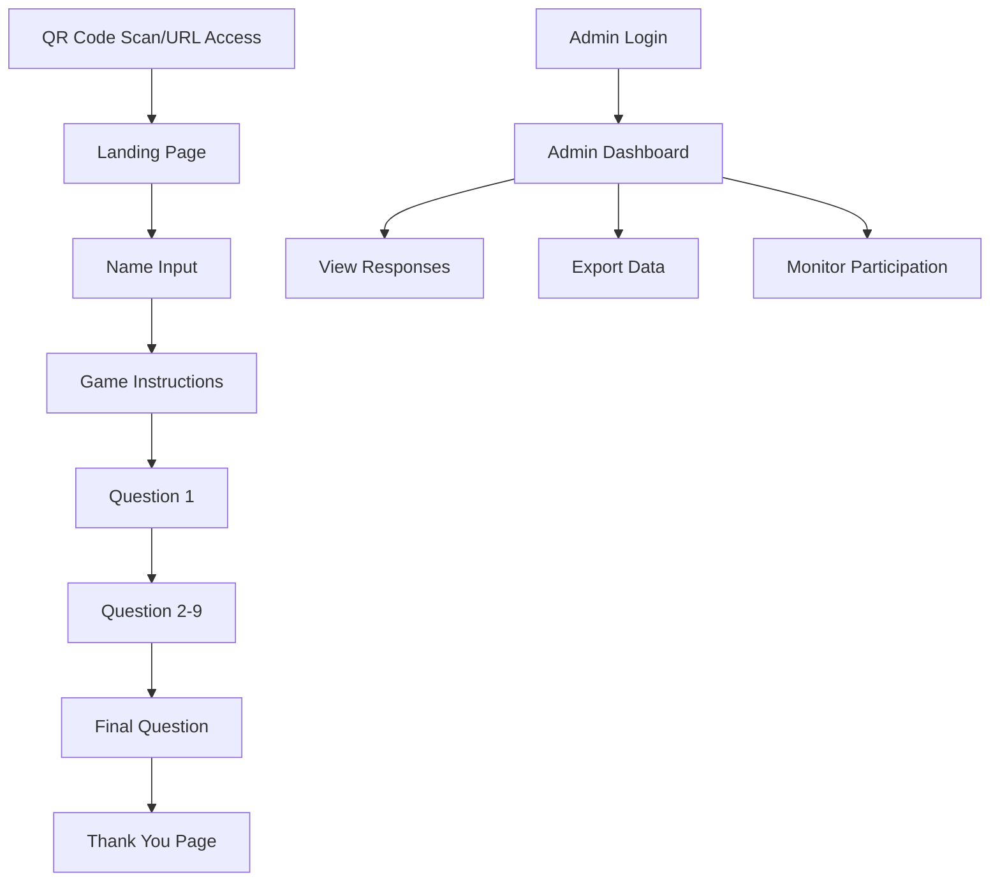

# Circuit Overseer Farewell Party Game - Product Requirements Document

## 1. Product Overview

A web-based interactive farewell party game designed for circuit overseer farewell gatherings, featuring QR code access, personalized questions, and real-time response collection.

The game allows congregation members to participate in a fun, respectful Q\&A experience about their circuit overseer while organizers can view and manage responses through a secure admin dashboard. This digital solution enhances traditional farewell gatherings by creating memorable, shareable content that celebrates the circuit overseer's service.

## 2. Core Features

### 2.1 User Roles

| Role        | Registration Method     | Core Permissions                                           |
| ----------- | ----------------------- | ---------------------------------------------------------- |
| Participant | Name input only         | Can access game, answer questions, view progress           |
| Admin       | Password authentication | Can view all responses, export data, monitor participation |

### 2.2 Feature Module

Our circuit overseer farewell game consists of the following main pages:

1. **Landing Page**: QR code display, welcome message, name input field, game instructions.
2. **Game Page**: Interactive questions, progress indicator, answer submission, navigation controls.
3. **Thank You Page**: Completion message, participation summary, social sharing options.
4. **Admin Dashboard**: Response viewer, participant counter, data export, real-time updates.

### 2.3 Page Details

| Page Name       | Module Name           | Feature description                                                              |
| --------------- | --------------------- | -------------------------------------------------------------------------------- |
| Landing Page    | QR Code Display       | Generate and display QR code for easy mobile access to game URL                  |
| Landing Page    | Welcome Section       | Display welcoming message and brief instructions about the farewell game         |
| Landing Page    | Name Input            | Collect participant name with validation, store for response tracking            |
| Landing Page    | Game Instructions     | Provide clear, simple instructions for all age groups                            |
| Game Page       | Question Display      | Present 8-10 respectful, fun questions about circuit overseer in various formats |
| Game Page       | Answer Collection     | Support multiple choice, short answer, and creative response formats             |
| Game Page       | Progress Indicator    | Show current question number and overall progress through game                   |
| Game Page       | Navigation Controls   | Previous/next buttons, answer validation, auto-save functionality                |
| Thank You Page  | Completion Message    | Display personalized thank you message with participant name                     |
| Thank You Page  | Participation Summary | Show completed questions count and submission confirmation                       |
| Thank You Page  | Social Sharing        | Optional sharing buttons for social media or messaging apps                      |
| Admin Dashboard | Authentication        | Password-protected access to admin features                                      |
| Admin Dashboard | Response Viewer       | Display all submitted responses organized by participant name                    |
| Admin Dashboard | Participant Counter   | Real-time count of total participants and completion rates                       |
| Admin Dashboard | Data Export           | Export responses in CSV/PDF format for sharing with congregation                 |
| Admin Dashboard | Real-time Updates     | Live updates of new responses without page refresh                               |

## 3. Core Process

**Participant Flow:**
Participants scan QR code or access URL → Enter name on landing page → Read instructions → Start game → Answer 8-10 questions with progress tracking → Submit final answers → View thank you message with completion summary.

**Admin Flow:**
Admin accesses dashboard with password → Views real-time participant counter → Reviews all submitted responses organized by name → Exports data for congregation sharing → Monitors ongoing participation.

## 4. User Interface Design

### 4.1 Design Style

* **Primary Colors**: Deep blue (#2C5282) and warm gold (#D69E2E) for professional, welcoming appearance

* **Secondary Colors**: Light gray (#F7FAFC) backgrounds, white (#FFFFFF) content areas

* **Button Style**: Rounded corners (8px radius), subtle shadows, hover animations

* **Typography**: Clean sans-serif fonts (Inter/Roboto), 16px base size, 18px+ for mobile

* **Layout Style**: Card-based design with generous white space, centered content, mobile-first approach

* **Icons**: Simple, outlined icons with religious/community themes where appropriate

### 4.2 Page Design Overview

| Page Name       | Module Name         | UI Elements                                                                |
| --------------- | ------------------- | -------------------------------------------------------------------------- |
| Landing Page    | QR Code Display     | Centered QR code with border, download/print options, responsive sizing    |
| Landing Page    | Welcome Section     | Large heading, warm greeting text, circuit overseer photo placeholder      |
| Landing Page    | Name Input          | Clean input field with label, validation messages, prominent submit button |
| Game Page       | Question Display    | Card-based layout, question numbering, clear typography, answer options    |
| Game Page       | Progress Indicator  | Horizontal progress bar, "Question X of Y" text, percentage completion     |
| Game Page       | Navigation Controls | Previous/Next buttons, submit confirmation, loading states                 |
| Thank You Page  | Completion Message  | Celebration graphics, personalized text, completion badge                  |
| Admin Dashboard | Response Viewer     | Sortable table, search functionality, expandable response details          |
| Admin Dashboard | Data Export         | Download buttons, format selection, progress indicators                    |

### 4.3 Responsiveness

Mobile-first responsive design optimized for smartphone access with touch-friendly interfaces. Desktop version provides enhanced admin dashboard experience with larger data tables and export options.

## 5. Sample Questions

1. **Multiple Choice**: "What's Brother \[Name]'s favorite way to start his talks?"

   * A) With a warm smile and greeting

   * B) With an interesting illustration

   * C) With a scripture reading

   * D) With a personal experience

2. **Short Answer**: "What's the most memorable piece of advice Brother \[Name] has shared with our congregation?"

3. **Creative Response**: "If Brother \[Name] were a Bible character, who would he be and why?"

4. **Multiple Choice**: "What's Brother \[Name]'s go-to scripture for encouragement?"

   * A) Philippians 4:13

   * B) Isaiah 41:10

   * C) Romans 8:28

   * D) Jeremiah 29:11

5. **Short Answer**: "What's your favorite memory from one of Brother \[Name]'s visits?"

6. **Multiple Choice**: "How would you describe Brother \[Name]'s speaking style?"

   * A) Gentle and encouraging

   * B) Enthusiastic and energetic

   * C) Practical and down-to-earth

   * D) Thoughtful and deep

7. **Creative Response**: "Complete this sentence: 'Brother \[Name] always reminds us that...'"

8. **Short Answer**: "What quality of Brother \[Name] would you most like to develop in yourself?"

9. **Multiple Choice**: "What's Brother \[Name]'s favorite part of circuit work?"

   * A) Meeting new friends

   * B) Encouraging the brothers and sisters

   * C) Sharing in the ministry

   * D) Building up congregations

10. **Creative Response**: "What message would you like to leave for Brother \[Name] as he moves to his new assignment?"

## 6. Technology Stack

**Frontend**: React 18 with TypeScript for type safety and modern development practices
**Styling**: Tailwind CSS for responsive design and consistent styling
**State Management**: React Context API for simple state management
**QR Code**: qrcode.js library for QR code generation
**Data Storage**: Local Storage for temporary data, with option to integrate backend database
**Build Tool**: Vite for fast development and optimized builds
**Deployment**: Vercel or Netlify for easy deployment and hosting
**Additional Libraries**:

* React Router for navigation

* React Hook Form for form handling

* Framer Motion for smooth animations

* jsPDF for PDF export functionality

## 7. Security and Data Considerations

* Input validation and sanitization for all user inputs

* Admin password protection with session management

* Data encryption for stored responses

* GDPR compliance considerations for data collection

* Option for automatic data deletion after event completion

* Secure export functionality with access controls

